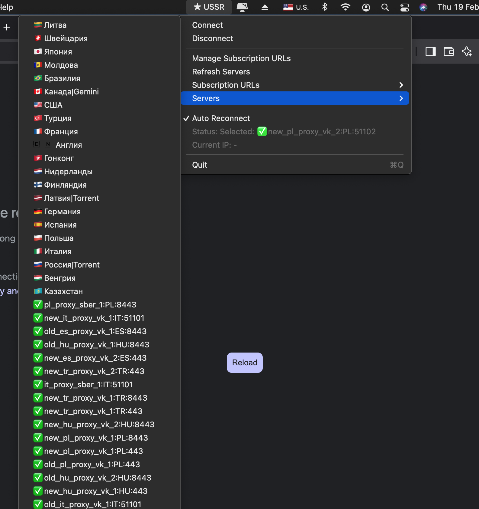

# BACK_TO_USSR
## Universal Secure Server Router

Lightweight menu-bar VPN client for old Intel Macs (macOS Big Sur 11.x+).

It solves the lockout loop:
- no open internet -> cannot install VPN from App Store
- no VPN -> cannot get open internet

`BACK_TO_USSR` is built to be transferred offline (AirDrop/USB), launched, and used immediately.

## Why This Project Exists
- Real-world case: old MacBook Pro 2015 (Intel, Big Sur 11.7.10)
- Many modern clients require newer macOS or App Store
- Existing tools were unstable in blocked networks

This project provides a simple path: add subscription URL(s), refresh, connect, and recover access.

## Features
- Menu-bar app near macOS clock (`★ USSR`)
- Multiple subscription URLs (unlimited, one per line)
- Refresh from all URLs + merge + deduplicate nodes
- Server picker by country/name
- Auto-dial fallback:
  - selected server -> last successful -> full pool
  - tries `flow on -> flow off`
- Auto-reconnect monitor
- System SOCKS on/off with admin prompt
- Current external IP check in app menu
- Optional anthem notifications:
  - random track selection
  - anti-repeat
  - cooldown by timestamp
  - mute toggle

## Screenshot


## Demo
- [Video demo](docs/media/demo.mp4)

## Install
1. Open [Releases](https://github.com/danilagoleen/back_to_ussr/releases)
2. Download `BACK_TO_USSR.app.zip`
3. Move `BACK_TO_USSR.app` to `/Applications`
4. If macOS blocks launch:
   ```bash
   xattr -cr /Applications/BACK_TO_USSR.app
   ```
5. Launch app -> `Manage Subscription URLs` -> add URL(s) -> `Refresh Servers` -> `Connect`

## Build
```bash
./build_back_to_ussr_app.command
```

Output:
- `dist/BACK_TO_USSR.app`
- `dist/BACK_TO_USSR.app.zip`

## Tests
```bash
./scripts/run_tests.sh
```

Live subscription check can be enabled with:
```bash
SUBSCRIPTION_URLS="https://example.com/sub1,https://example.com/sub2" ./scripts/run_tests.sh
```

## Architecture (Short)
- `Swift + AppKit` menu-bar app (`LSUIElement`)
- bundled `sing-box` (`x86_64`) inside app resources
- runtime config generation from parsed VLESS nodes
- SOCKS validation with `curl`
- periodic monitor for reconnect logic

## License
MIT. See [LICENSE](LICENSE).
