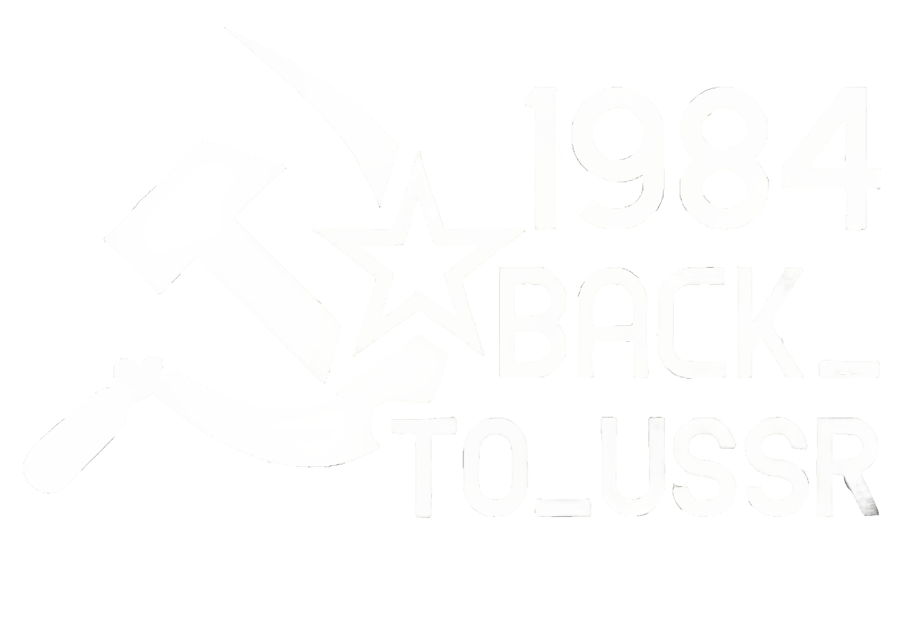

# BACK_TO_USSR
## Universal Secure Server Router

Lightweight menu-bar VPN client for old Intel Macs (macOS 11 Big Sur+), built to break the classic lockout loop:

- no open internet -> cannot install VPN from App Store
- no VPN -> cannot get open internet

`BACK_TO_USSR` is a practical offline-transferable client: build once, AirDrop, run.

## Origin Story
The project started from a real case:
- friend returned to Russia after 13 years;
- old MacBook Pro 2015 (Intel, Big Sur 11.7.10);
- modern VPN apps were either App Store-only, too new for old macOS, or unreliable in blocked networks.

After many failed installs and broken clients, we built our own simple app that actually works on old hardware and blocked networks.

## Who It Is For
- users on old Macs (especially Intel Big Sur)
- people who cannot install from App Store in restricted networks
- families with non-technical users (parents / grandparents)
- users of URL-based subscription services (e.g. Liberty VPN style VLESS subscriptions)

## Key Features
- Menu-bar app (icon near macOS clock)
- Multiple subscription URLs (unlimited, one per line)
- Refresh from all URLs + merge + deduplicate nodes
- Server picker with country labels
- Auto-dial/fallback:
  - selected server first
  - then last successful
  - then full pool
  - tries `flow on -> flow off`
- Auto-reconnect monitor (periodic health checks)
- System SOCKS enable/disable via admin prompt
- In-app status + current external IP
- Meme-grade notification audio:
  - bundled mp3 playlist
  - random track selection
  - anti-repeat (no same track twice in a row)
  - cooldown by timestamp
  - mute toggle

## Why This Is Different
- Works on old Intel macOS 11 where many modern clients fail
- No App Store dependency for initial installation
- Built-in retry/autodial behavior focused on unstable/blocked routes
- Notification audio and playful UX while still staying practical

## Architecture (Short)
- `Swift + AppKit` menu-bar application (`LSUIElement`)
- bundled `sing-box` binary (`x86_64`) inside app resources
- runtime config generation from parsed VLESS nodes
- parser pipeline:
  - fetch URL
  - decode plain/base64/urlsafe subscription payloads
  - parse `vless://` lines
  - deduplicate nodes
- connection pipeline:
  - spawn sing-box
  - test via SOCKS (`curl`)
  - set system SOCKS proxy
- monitor pipeline:
  - periodic health check
  - reconnect if lost and auto-reconnect enabled

## Media
Toolbar/menu:


Brand image:



Demo video:
- [Watch demo](docs/media/demo.mp4)

## Build
```bash
./build_back_to_ussr_app.command
```

Output:
- `dist/BACK_TO_USSR.app`
- `dist/BACK_TO_USSR.app.zip`

## Tests
```bash
./scripts/run_tests.sh
```

Includes:
- parser/decode unit checks
- live subscription checks
- build smoke checks

## Legal Note
Use only where legal and for legitimate access and communication needs.
