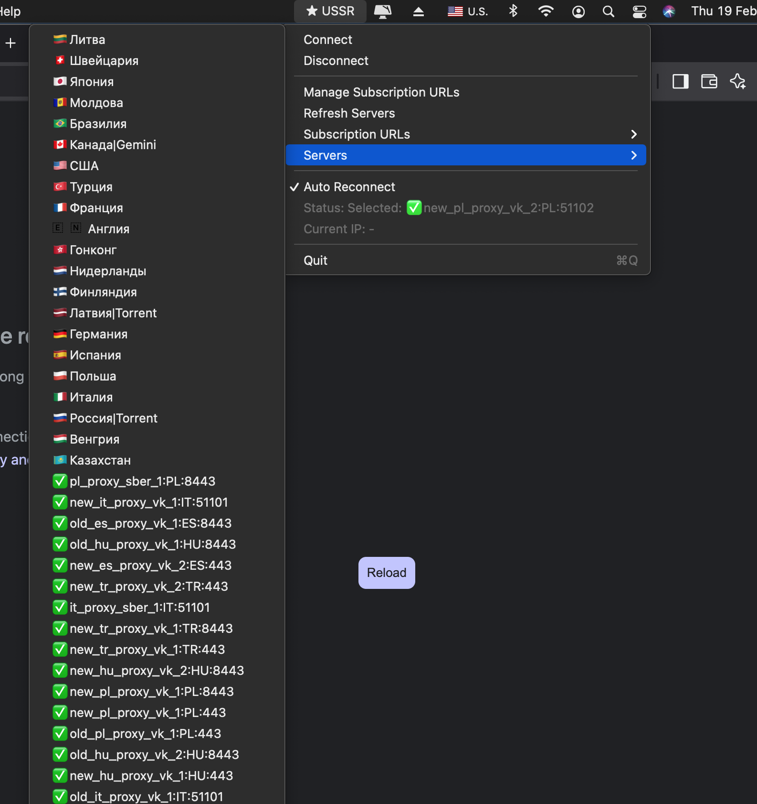

# BACK_TO_USSR
## Universal Secure Server Router
[](https://github.com/danilagoleen/back_to_ussr/releases/tag/v1.0.1)
[](LICENSE)
[](https://github.com/danilagoleen/back_to_ussr)

Лёгкий menu-bar VPN-клиент для Mac (Intel и Apple Silicon, macOS Big Sur 11.x+).

Решает замкнутый круг:
- без VPN не открыть интернет;
- без интернета не скачать VPN из App Store.

`BACK_TO_USSR` можно передать офлайн (AirDrop/USB), запустить и сразу использовать.

## Origin Story
Идея родилась из реальной ситуации: друг не был в России 13 лет, приехал со старым MacBook Pro 2015 (Intel, Big Sur 11.7.10), а большинство современных VPN-клиентов:
- требовали macOS 12+;
- требовали App Store;
- или были слишком сложными и нестабильными.

Итог был один: ошибки, неработающие клиенты, нулевая диагностика.
Поэтому и появился `BACK_TO_USSR` как простой “народный клиент”: добавить URL, обновить сервера, подключиться.

## Что умеет
- menu-bar приложение (иконка рядом с часами `★ USSR`);
- несколько subscription URL одновременно (без ограничений);
- объединение серверов из всех URL + удаление дублей;
- ручной выбор сервера/страны;
- автодозвон:
  - выбранный сервер -> последний успешный -> весь пул;
  - fallback `flow on -> flow off`;
- авто-переподключение при потере связи;
- включение/выключение системного SOCKS c правами администратора;
- показ текущего IP и статуса в меню;
- музыкальные оповещения (случайный трек, anti-repeat, cooldown, mute).

## Для кого
- для тех, кто давно не был в РФ и приехал со старым Mac;
- для семей со старыми компьютерами;
- для пользователей, которым нужен рабочий инструмент “включил и пользуйся”.

## Compatibility
- Intel Mac: работает нативно (`x86_64`).
- Apple Silicon (M1/M2/M3/M4): работает нативно (`arm64`).
- Текущая сборка universal: `x86_64 + arm64`.
- Минимальная версия macOS: 11+.

## Совместимость подписок
Протестировано:
- Liberty VPN (`VLESS + Reality` subscription URLs).

Ожидаемо работает:
- провайдеры, которые отдают совместимые `vless://` ноды;
- payload форматы: plain text, base64, urlsafe-base64.

Не гарантируется “из коробки”:
- другие протоколы (`vmess://`, `trojan://`, `ss://`);
- нестандартные/кастомные форматы подписок у отдельных панелей.

## Screenshot


## Demo
- [Video demo](docs/media/demo.mp4)

## Install
1. Open [Releases](https://github.com/danilagoleen/back_to_ussr/releases)
2. Download `BACK_TO_USSR.dmg` or `BACK_TO_USSR.app.zip`
3. Open the DMG or move `BACK_TO_USSR.app` to `/Applications`
4. If macOS blocks launch:
   ```bash
   xattr -cr /Applications/BACK_TO_USSR.app
   ```
5. Launch app -> `Manage Subscription URLs` -> add URL(s) -> `Refresh Servers` -> `Connect`

Provider guide (Liberty VPN, VLESS on macOS):
- [https://teletype.in/@vpnliberty/Vless-macOS](https://teletype.in/@vpnliberty/Vless-macOS)

## Build
```bash
./build_back_to_ussr_app.command
```

Output:
- `dist/BACK_TO_USSR.app`
- `dist/BACK_TO_USSR.app.zip`
- `dist/BACK_TO_USSR.dmg`

## Tests
```bash
./scripts/run_tests.sh
```

Live subscription check can be enabled with:
```bash
SUBSCRIPTION_URLS="https://example.com/sub1,https://example.com/sub2" ./scripts/run_tests.sh
```

## Architecture (Short)
- `Swift + AppKit` menu-bar app (`LSUIElement`)
- bundled universal `sing-box` (`x86_64 + arm64`) inside app resources
- runtime config generation from parsed VLESS nodes
- SOCKS validation with `curl`
- periodic monitor for reconnect logic

## English (short)
`BACK_TO_USSR` is a lightweight menu-bar VPN client for old Macs.
It was built from a real lockout case (no internet -> no VPN install -> no internet), supports multi-URL VLESS subscriptions, autodial, reconnect, and easy offline transfer.

## License
MIT. See [LICENSE](LICENSE).

---

## External Dependencies

### Required
- **Xcode 13+** — for building
- **Swift 5.9+** — language

### Build Tools
```bash
# Install Xcode from App Store or:
xcode-select --install
```

### Runtime Dependencies (Bundled)
- **sing-box** — VPN core (bundled inside app as universal binary)
- **curl** — for SOCKS validation (system provided)

### Optional
- **Homebrew** — for dependency management (`brew install wget`)

### System Requirements
- macOS 11+ (Big Sur)
- Tested on: Intel (x86_64) and Apple Silicon (arm64)

### Build
```bash
./build_back_to_ussr_app.command
# Or manually:
xcodebuild -scheme back_to_ussr -configuration Release
```
